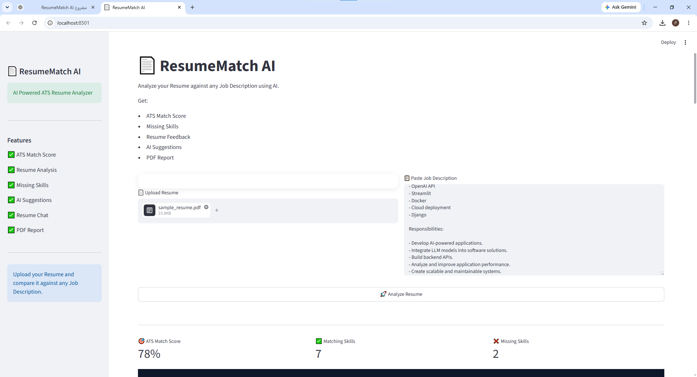
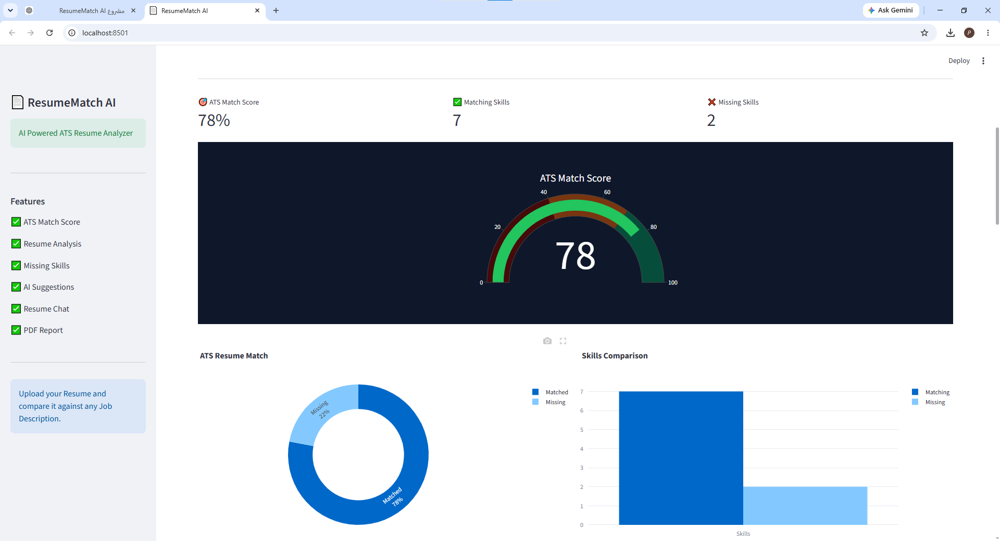
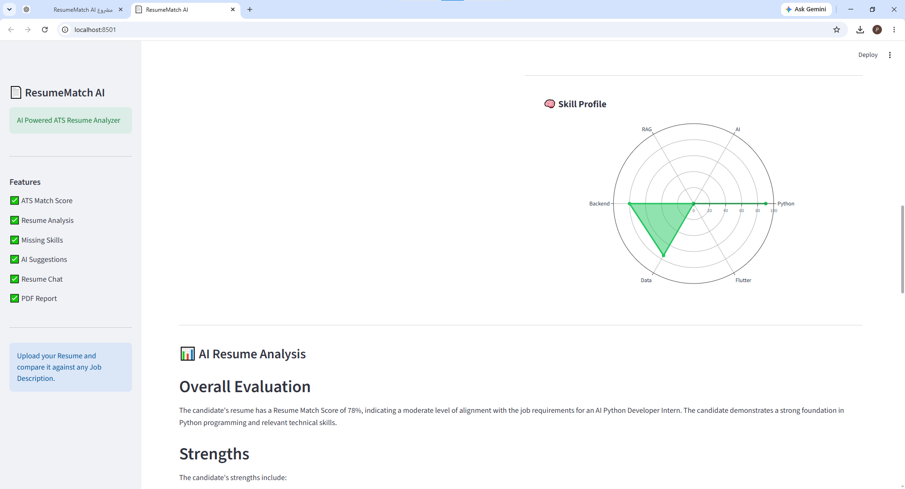
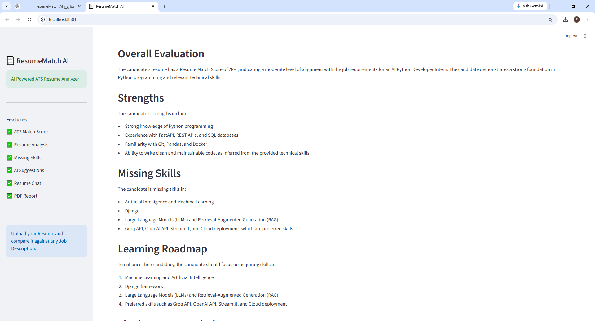
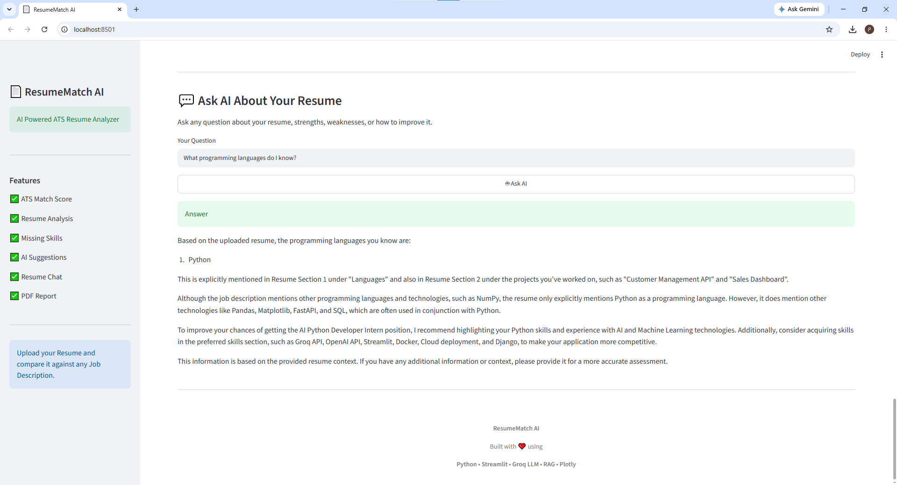

# 📄 ResumeMatch AI

An AI-powered ATS Resume Analyzer that helps job seekers evaluate their resumes against job descriptions using LLMs, RAG, and NLP techniques.

The system analyzes resumes, detects missing skills, provides AI-powered recommendations, and allows users to chat with their resume.

---

# 🚀 Features

✅ Upload Resume PDF  
✅ Extract Resume Information Automatically  
✅ Compare Resume with Job Description  
✅ ATS Match Score Calculation  
✅ Matching Skills Detection  
✅ Missing Skills Identification  
✅ AI Resume Feedback  
✅ Learning Roadmap Recommendations  
✅ Skill Radar Visualization  
✅ Resume Chat Assistant using RAG  
✅ Generate PDF Resume Report  

---

# 🧠 How It Works

1. User uploads a resume PDF.

2. The system extracts resume text using PDF processing.

3. User provides a Job Description.

4. Resume skills are compared with required job skills.

5. ATS score is calculated.

6. LLM generates:
   - Resume evaluation
   - Missing skills
   - Improvement suggestions
   - Career roadmap

7. User can ask questions about the resume using RAG.

---

# 🏗️ System Architecture

```
Resume PDF
     |
     ↓
PDF Text Extraction
     |
     ↓
Text Cleaning & Chunking
     |
     ↓
Vector Search / Retrieval
     |
     ↓
RAG Pipeline
     |
     ↓
Groq LLM
     |
     ↓
AI Resume Analysis
```

---

# 🛠️ Tech Stack

### Programming Language
- Python

### AI & LLM
- Groq LLM API
- OpenAI SDK
- Retrieval-Augmented Generation (RAG)

### Framework
- Streamlit

### NLP & Search
- MinSearch
- Text Processing

### Visualization
- Plotly

### Other Tools
- Python-dotenv
- PDF Processing
- Git & GitHub

---

# 📂 Project Structure

```
ResumeMatch-AI/

│
├── app.py
├── rag.py
├── matcher.py
├── parser.py
├── chunking.py
├── search.py
├── utils.py
├── pdf_report.py
├── requirements.txt
├── .env
│
└── screenshots/
    ├── home.png
    ├── ats_score.png
    ├── radar.png
    ├── analysis.png
    └── chat.png
```

---

# 📸 Application Screenshots

## 🏠 Resume Upload & Job Description




---

## 🎯 ATS Match Score




---

## 🧠 Skill Profile Visualization




---

## 📊 AI Resume Analysis Report




---

## 💬 Chat With Your Resume



# ▶️ Run Locally

## 1. Clone Repository

```bash
git clone https://github.com/Ai-MAFlutter/ResumeMatch-AI.git
```

---

## 2. Create Virtual Environment

```bash
python -m venv .venv
```

Activate:

Windows:

```bash
.venv\Scripts\activate
```

---

## 3. Install Dependencies

```bash
pip install -r requirements.txt
```

---

## 4. Setup Environment Variables

Create a `.env` file:

```env
GROQ_API_KEY=your_api_key_here
```

---

## 5. Run Application

```bash
streamlit run app.py
```

---

# 📌 Example Usage

### Input:

Resume:

```
Python Developer Resume
```

Job Description:

```
Looking for AI Python Developer with:
- Python
- FastAPI
- Docker
- LLM
- RAG
- Cloud
```

---

### Output:

The application provides:

- ATS Match Score
- Matching Skills
- Missing Skills
- AI Recommendations
- Resume Improvement Roadmap

---

# 🤖 AI Capabilities

The project uses LLMs to:

- Understand resume context
- Analyze job requirements
- Generate professional feedback
- Answer questions about the resume

---

# 🔮 Future Improvements

- Add user authentication
- Deploy on cloud platform
- Add more resume templates
- Improve skill matching using embeddings
- Add multilingual resume support

---

# 👩‍💻 Author

Built with ❤️ using Python, AI, RAG, and Streamlit.
